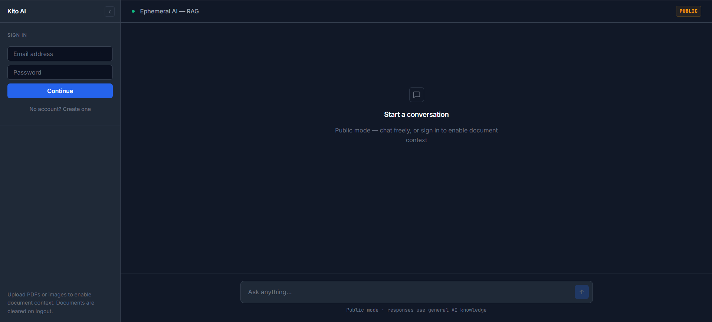
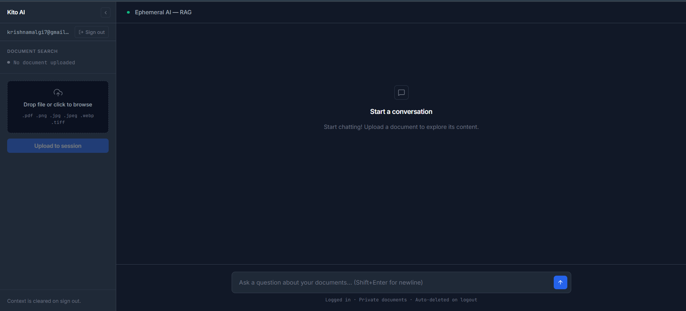
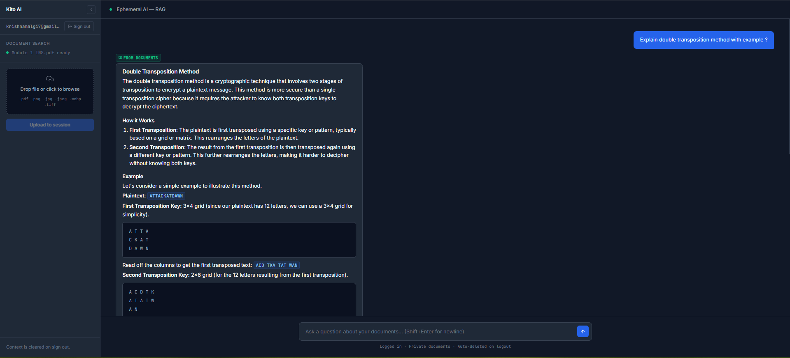
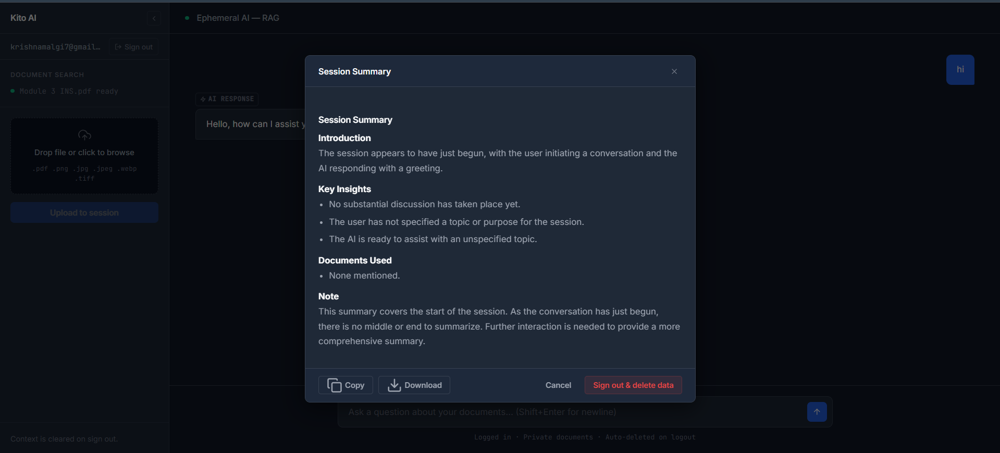
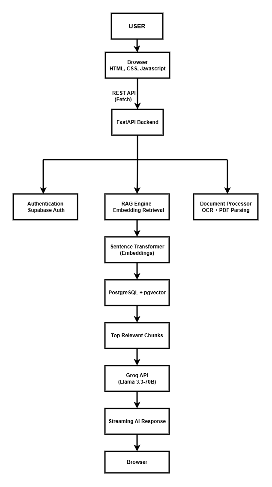
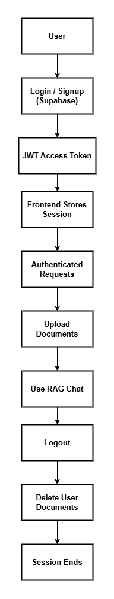
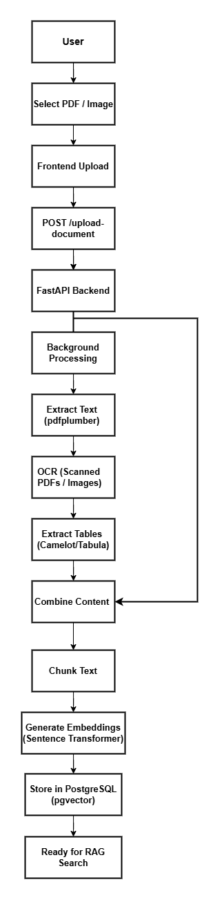
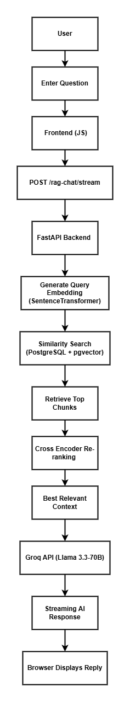
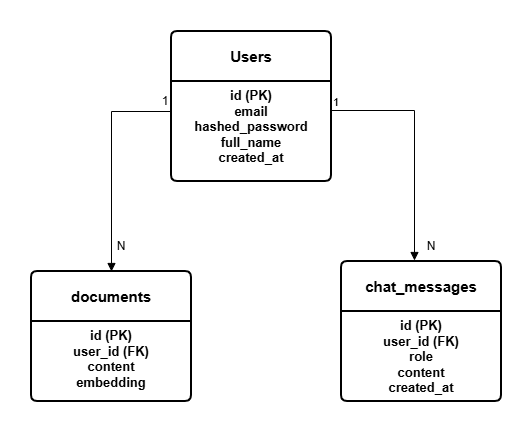

<div align="center">

# Kito AI

**An ephemeral Retrieval-Augmented Generation (RAG) chatbot that enables secure document-based conversations with automatic document cleanup after logout.**

Upload a PDF or image, ask questions about it, and get grounded answers — or just chat without an account. Every document you upload is permanently deleted the moment you log out.

[](https://www.python.org/)
[](https://fastapi.tiangolo.com/)
[](https://www.postgresql.org/)
[](https://supabase.com/)
[](https://groq.com/)
[](#license)

</div>

---

## Table of contents

- [Overview](#overview)
- [Screenshots](#screenshots)
- [Features](#features)
- [Architecture](#architecture)
  - [System architecture](#system-architecture)
  - [Authentication flow](#authentication-flow)
  - [Document upload pipeline](#document-upload-pipeline)
  - [RAG query flow](#rag-query-flow)
  - [Database schema](#database-schema)
- [Tech stack](#tech-stack)
- [Project structure](#project-structure)
- [Getting started](#getting-started)
- [API reference](#api-reference)
- [Known limitations](#known-limitations)
- [License](#license)

---

## Overview

Kito AI is a full-stack RAG (Retrieval-Augmented Generation) chatbot. It's built around one idea: you should be able to hand it a document and get answers grounded in that document, without that document living on a server forever.

- Anyone can chat with the assistant, no account required.
- Signed-in users can upload a PDF or an image (including scanned pages) and ask questions about it specifically.
- Every answer is labeled with where it came from — the uploaded document, or general model knowledge — so you always know how much to trust it.
- Logging out deletes every document and embedding tied to that account. Nothing persists beyond the session.

---

## Key Highlights

• Retrieval-Augmented Generation (RAG)

• Background document processing

• OCR for scanned PDFs and images

• Cross-encoder re-ranking

• Streaming AI responses

• PostgreSQL + pgvector vector search

• JWT Authentication

• Ephemeral document storage

• Session summary generation

## Screenshots

<table>
<tr>
<td width="50%">

**Home — public mode**
<br/>

<br/>
No account needed to start chatting. Signing in unlocks document search.

</td>
<td width="50%">

**Signed in — document search ready**
<br/>

<br/>
Once logged in, the sidebar switches to the upload panel.

</td>
</tr>
<tr>
<td width="50%">

**A grounded answer**
<br/>

<br/>
Responses are tagged "From documents" when they're grounded in what you uploaded.

</td>
<td width="50%">

**End-of-session summary**
<br/>

<br/>
Before your data is deleted, you get a summary you can copy or download.

</td>
</tr>
</table>

---

## Features

| Feature | Description |
|---|---|
| Public chat | Talk to the assistant with no account — general-knowledge answers only. |
| Document-grounded chat | Sign in, upload a document, and get answers sourced from its content. |
| OCR support | Scanned PDFs and photographed pages are read via OCR, not just parsed text. |
| Table extraction | Tabular data inside PDFs is extracted, not flattened into unreadable text. |
| Streaming responses | Answers stream back token by token instead of arriving all at once. |
| Source transparency | Every AI reply is labeled as document-grounded or general knowledge. |
| Background uploads | Uploads return immediately; processing progress is polled and shown live. |
| Ephemeral by design | Logging out permanently deletes all of that user's documents and embeddings. |
| Session summary | A short recap of the conversation is generated right before logout. |

---

## Architecture

### System architecture

<p align="center">
  
</p>

The browser talks to a single FastAPI backend over a REST API. The backend fans out to three responsibilities: authentication (via Supabase Auth), the RAG engine (embedding and retrieval), and the document processor (OCR and PDF parsing). Retrieval runs through a sentence-transformer embedding model into PostgreSQL with the `pgvector` extension, and the top matching chunks are passed to Groq's Llama 3.3-70B, which streams its answer back to the browser.

### Authentication flow

<p align="center">
  
</p>

Login and signup are handled by Supabase, which issues a JWT access token. The frontend holds onto that token for the session and attaches it to every authenticated request — uploading documents, chatting in RAG mode, and eventually logging out, which deletes the user's documents before the session ends.

### Document upload pipeline

<p align="center">
  
</p>

After a file is selected and posted to `/upload-document`, processing happens in the background so the request returns immediately. Text is extracted with `pdfplumber`, scanned pages go through OCR, and tables are pulled out separately before everything is combined, chunked, embedded, and stored in Postgres — after which the document is ready to be searched.

### RAG query flow

<p align="center">
  
</p>

A question is embedded with the same sentence-transformer model used at upload time, compared against stored vectors with `pgvector` similarity search, and the top candidates are re-ranked with a cross-encoder before the best context is handed to the LLM. The response streams back to the browser as it's generated.

### Database schema

<p align="center">
  
</p>

Each user can own multiple uploaded documents and chat messages. The `documents` table stores extracted document content together with vector embeddings used during retrieval. All document data associated with a user is automatically deleted on logout to maintain session privacy.

---

## Tech stack

| Layer | Technology |
|---|---|
| Frontend | HTML, CSS, vanilla JavaScript (ES6) |
| Backend | FastAPI (Python) |
| Database | PostgreSQL + `pgvector`, hosted on Supabase |
| Authentication | Supabase Auth (JWT) |
| Embeddings | `sentence-transformers/all-MiniLM-L6-v2` |
| Re-ranking | Cross-encoder re-ranker over top retrieved chunks |
| LLM | Groq — Llama 3.3-70B (streaming) |
| Document parsing | `pdfplumber`, OCR, table extraction |

---

## Project structure

```
Kito AI/
├── backend/
│   ├── app/                        FastAPI application code
│   ├── .env                        Environment variables (not committed)
│   └── requirements.txt
├── docs/
│   ├── diagrams/
│   │   ├── system-architecture.png
│   │   ├── authentication-flow.png
│   │   ├── document-upload-pipeline.png
│   │   ├── rag-query-flow.png
│   │   └── database-schema.png
│   └── screenshots/
│       ├── 01_home_page.png
│       ├── 02_rag_mode_enabled.png
│       ├── 03_document_response.png
│       └── 04_session_summary.png
├── frontend/
│   ├── chat.html                   The application Interface
│   ├── index.html                  Redirects to chat.html
│   ├── css/
│   └── js/
├── .gitignore
├── render.yaml
└── README.md
```

---

## Getting started

### Prerequisites

- Python 3.11+
- A Supabase project with the `pgvector` extension enabled
- A Groq API key
- Tesseract OCR and Poppler installed and on your system PATH

### 1. Set up the database

Run once in the Supabase SQL editor:

```sql
CREATE EXTENSION IF NOT EXISTS vector;

CREATE TABLE IF NOT EXISTS documents (
  id        BIGSERIAL PRIMARY KEY,
  content   TEXT,
  embedding VECTOR(384),
  user_id   TEXT
);

CREATE INDEX IF NOT EXISTS idx_documents_user_id ON documents(user_id);
```

### 2. Configure the backend

Create `backend/.env`:

```
DATABASE_URL=your_postgres_connection_string
GROQ_API_KEY=your_groq_api_key
SUPABASE_URL=https://your-project.supabase.co
SUPABASE_ANON_KEY=your_supabase_anon_key
```

### 3. Install and run the backend

```bash
cd backend
python -m venv venv
source venv/bin/activate        # Windows: venv\Scripts\activate
pip install -r requirements.txt
uvicorn app.main:app --reload
```

The API is now available at `http://127.0.0.1:8000`.

### 4. Configure and serve the frontend

Set your Supabase URL, Supabase anon key, and backend API base URL in `frontend/js/config.js`, then serve the folder with any static file server:

```bash
cd frontend
python -m http.server 8080
```

Visit `http://localhost:8080`.

---

## API Reference

### Authentication & Health

| Method | Endpoint | Description |
|--------|----------|-------------|
| `GET` | `/` | Health check endpoint to verify the backend is running. |

---

### Chat APIs

| Method | Endpoint | Description |
|--------|----------|-------------|
| `POST` | `/rag-chat` | Generate a standard (non-streaming) AI response. |
| `POST` | `/rag-chat/stream` | Stream AI responses token-by-token for real-time chat. |
| `POST` | `/api/session/summary` | Generate a summary of the current chat session before logout. |

---

### Document APIs

| Method | Endpoint | Description |
|--------|----------|-------------|
| `POST` | `/upload-document` | Upload a document and start asynchronous background processing. Returns a `job_id`. |
| `GET` | `/upload-document/status/{job_id}` | Check the processing status of an uploaded document. |
| `DELETE` | `/clear-user-documents` | Delete all uploaded documents and embeddings associated with the authenticated user. |

---

### Legacy Endpoint

| Method | Endpoint | Description |
|--------|----------|-------------|
| `POST` | `/upload-pdf` | Legacy synchronous document upload endpoint (retained for backward compatibility). |

---

## Current Limitations

- Upload job status is stored in memory, so it doesn't survive a backend restart or scale across multiple instances without moving to shared storage such as Redis.
- OCR and table extraction depend on Tesseract and Poppler being installed on the host — they aren't pulled in automatically by `pip install`.
- CORS is currently open to all origins for ease of local development; restrict this before deploying publicly.

---


## Author

**Krishna Sudhir Malgi**

- GitHub: https://github.com/Krishnamalgi7
- LinkedIn: https://www.linkedin.com/in/krishna-malgi/